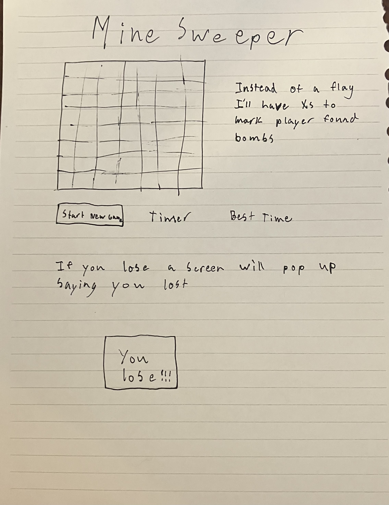

## html:
h1 tag saying the game is minesweeper
add divs for the grid
add a button at the bottom that resets the grid
add a timer to the right of the button
add a win and lose window

## css:
make the divs 14 by 18 grid
make the grid look clean
add cool soft colored background

## javascript
button refreshes the page
once per secound, have a function that changes the timer on the screen

add event listeners to all the divs in the grid

function whenClicked uncovers tile, reveling bomb or empty tile, calls the whichTypeOfTile function, and the win Function

function whichTypeOfTile determins the value of the tile, and calls different functions depending on that value

function bombTile uncovers all other bombs, and creates a new screen that tells the player they lost

function emptyTile, automatically clicks all other tiles that are adjacent to it, but not adjacent to a bomb

function numberTile displays number of adjacent bombs next to the newly uncovered tile

function win checks if only bomb tiles remain, and if true then pulls up a display window saying that the player has won, and reading the time it took them to win.  Calls stopClock function

function stopCLock stops increasing the timer

## bonus points
plays a noise everytime you click a tile, and a different one for a bomb
some chill background music
a nav bar where you can go and play some other games (like the tictactoe that I already made)